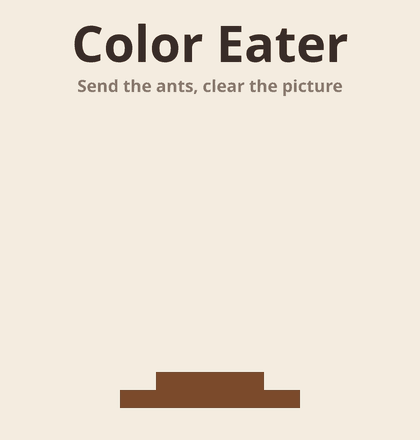
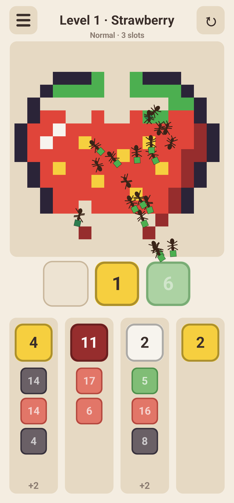
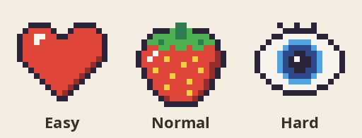

<p align="center">
  
  &nbsp;&nbsp;
  
</p>

<p align="center">
  <b>A cozy little puzzle game for Android where ants eat pixel art, one pixel at a time.</b><br>
  <a href="https://github.com/Powerkrieger/ColorEater/releases/latest"><b>⬇ Download the latest APK</b></a>
</p>

---

## How to play

A pixel-art picture sits on top of the screen, and below it wait four queues of **volumes**. A volume
is a color plus a number of pixels. Tap a queue to move its front volume into one of the few
**slots**, and ants from that slot swarm out and carry away pixels of that color.

The catch: ants can only reach pixels that are **exposed**, meaning they touch the edge of the
picture or a hole that has already been eaten. The picture gets eaten from the outside in. A
volume whose color is still buried has to wait in its slot, and slots are precious.

- 🏆 **Win** by clearing every pixel.
- 🪤 **Lose** when every slot is full and no volume can eat.

A level in progress is saved after every move, so you can close the app and pick up where you
left off. Progress of each difficulty can be reset in the settings (the cog on the title screen).

The obvious move is often the wrong one: grabbing the biggest bite right away tends to leave
buried colors waiting in your slots until you're stuck.

## 111 pictures to uncover

<p align="center">
  
</p>

Every level brings a picture, and they come in themed runs: a few fruits, then a couple of
animals, then some famous paintings, and so on. Each category starts simple and gets harder
every time it comes around, and once it has shown everything, its early pictures drop out.
Completed levels show their picture in the level list.

| | Easy | Normal | Hard |
|---|---|---|---|
| Pictures | 32 simple ones with few colors | 31 with many colors and details tucked inside | 48 with colors walled in several layers deep |
| Categories | 5, taking turns | 5, taking turns | 8, from easy to hard: new ones come in, the easiest leave |
| Spare slots | 2 | 1 | Usually none |
| Mystery volumes `?` | – | Sometimes | On every third level |

Every level is **guaranteed to be winnable**: the generator plays a solution itself, and a solver
then hands you only as many slots as the level really needs (plus the spare ones).

## Download

Grab `coloreater.apk` from the [latest release](https://github.com/Powerkrieger/ColorEater/releases/latest)
and open it on your Android phone (you may have to allow installing apps from unknown sources).
Requires Android 8.0 or newer.

`coloreater-kids.apk` is the same game with a daily limit of 30 minutes of play. After that no new
level can be started until tomorrow, but the one in progress can still be finished, and changing
the phone's clock doesn't help. Both editions install over each other as an update and keep
the progress, so you can switch either way.

## Under the hood

- Kotlin, a single custom `View` drawn with Canvas. No game engine, no image files: even the ants
  are drawn in code, with a six-legged tripod gait.
- The rules are deterministic and pure Kotlin, shared by the game, the level generator and the solver.
- [`docs/DESIGN.md`](docs/DESIGN.md) explains the algorithms and why they look the way they do.

### Build and run

```sh
./gradlew installStandardDebug       # build and install on a connected device
./gradlew installKidsDebug           # the same with the daily time limit
./gradlew testStandardDebugUnitTest  # rules, generator and level tests
```

After changing the level generator, the level settings or the pictures, regenerate the shipped levels:

```sh
WRITE_LEVELS=1 ./gradlew testStandardDebugUnitTest --tests '*LevelAssetsTest*'
```

### Project layout

- `app/src/main/java/.../game/`: rules, solver, level generator, categories (pure Kotlin)
- `app/src/main/java/.../game/pictures/`: the pictures, one file per difficulty, one letter per pixel
- `app/src/main/java/.../ui/`: game view, title animation, play session, ants
- `app/src/main/assets/levels/`: pre-generated levels

### Releases

GitHub Actions (`.github/workflows/build.yml`) runs the unit tests and builds a signed release
APK on every push to `main`. Pushing a tag `v*` also publishes a GitHub release with the APK:

```sh
git tag v0.1.0 && git push origin v0.1.0
```

Signing uses the repo secrets `KEYSTORE_BASE64`, `KEYSTORE_PASSWORD`, `KEY_ALIAS` and
`KEY_PASSWORD`. Locally the keystore is `coloreater-release.jks` with its passwords in
`coloreater-release.env`; both are gitignored. Keep a backup: without the keystore, installed
copies can't be updated.

---

<p align="center"><sub>Created with AI.</sub></p>
